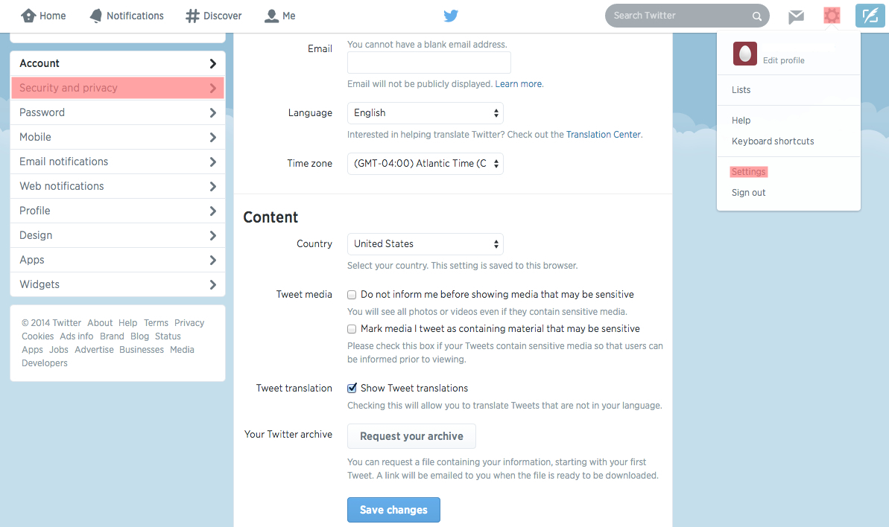
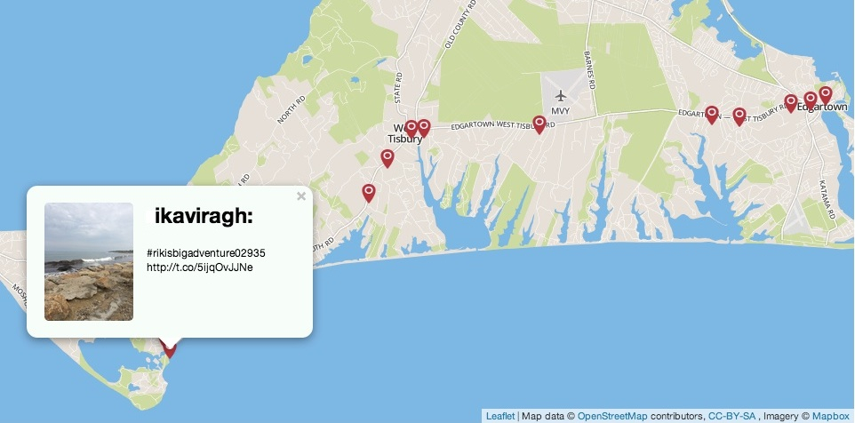

#Wayfaring Tweets

##Overview
[Wayfaring Tweets](http://glacial-hollows-6244.herokuapp.com/ "Wayfaring Tweets") is a Rails app that allows users to retrieve an array of geo-tagged tweets of a chosen hashtag to be overlayed onto a gorgeous [Leaflet](http://leafletjs.com/ "Leaflet") map. The project was initially intended to allow users to recount roadtrips, but has potential for multiple use cases. Wayfaring Tweets was developed over a 5-day sprint as my final project for [General Assembly's WDI program](https://generalassemb.ly/education/web-development-immersive "General Assembly's WDI program"), and was inspired by my love of maps and telling stories. 

##Technologies Used
* [Twitter Rest API v1.1](https://dev.twitter.com/docs/api/1.1 "Twitter Rest API v1.1")
* [RequireJS](http://requirejs.org/ "RequireJS")
* [Backbone.js](http://backbonejs.org/ "Backbone.js")
* [Leaflet](http://leafletjs.com/ "Leaflet")

##User Stories
* A user can submit a twitter handle and hashtag to instantly view an array of geo-tagged tweets
* A user can click on an individal Leaflet marker to view associated tweet details
* A user can load an entirely new array of tweets after submitting a new twitter handle and hashtag

##How to use Wayfaring Tweets:
###Log in to your twitter account
* click the cog in the upper, right corner
* a drop-down menu will appear, click 'settings'
* after clicking 'settings', visit the left sidebar to click 'security and privacy'

##Sample Wayfaring Roadtrip

